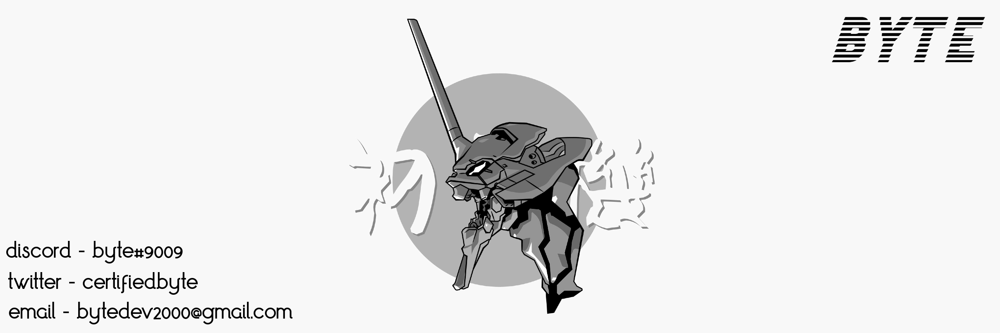

<h1 align="left"> Hey there , I'm Byte </h1>

<h2 align ="left">  Aspiring computer engineer, an intuitive mind with ambition. </h2>

<h2> Skills :
<h3> Python development, problem solving and out of the box creativity.
  

<a href="https://www.python.org/" target="blank">

<a href="https://github.com/bytedevelopmentation.com/" target="blank">

